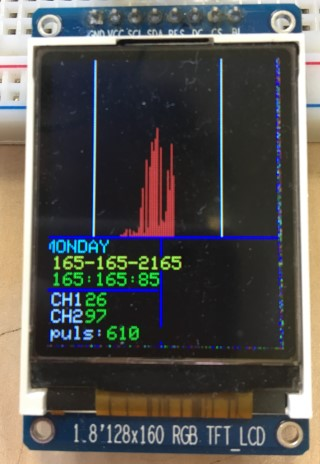
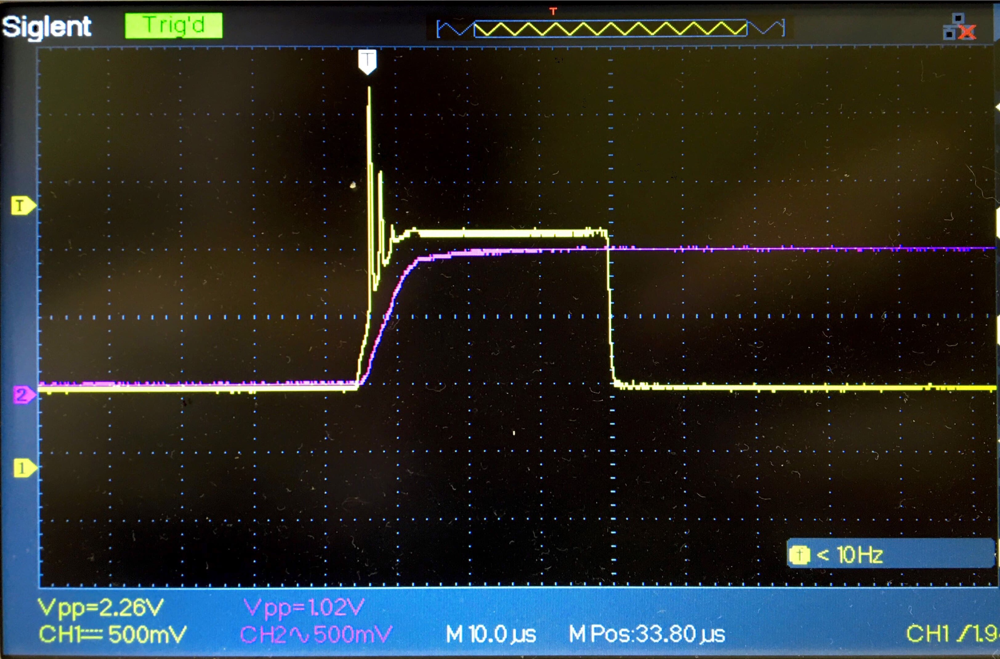
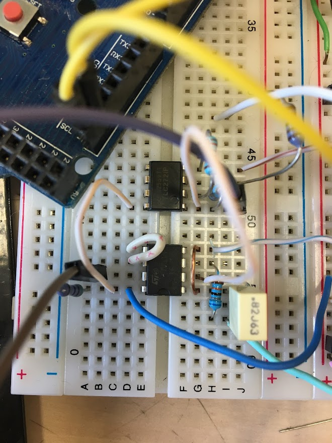
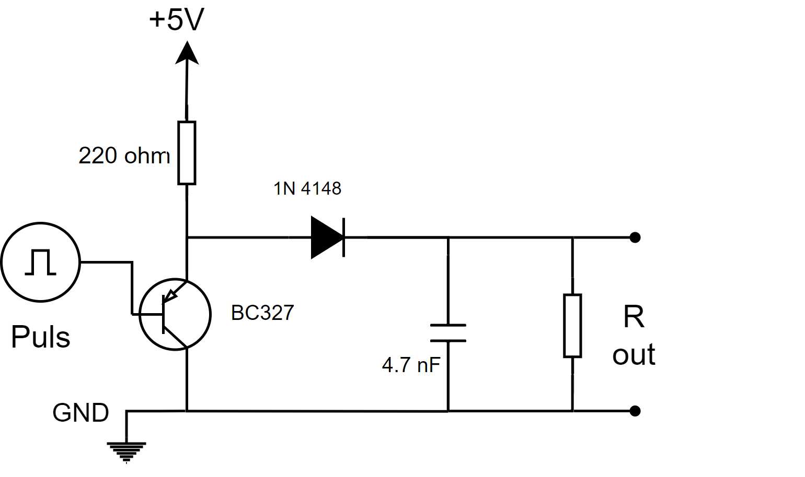
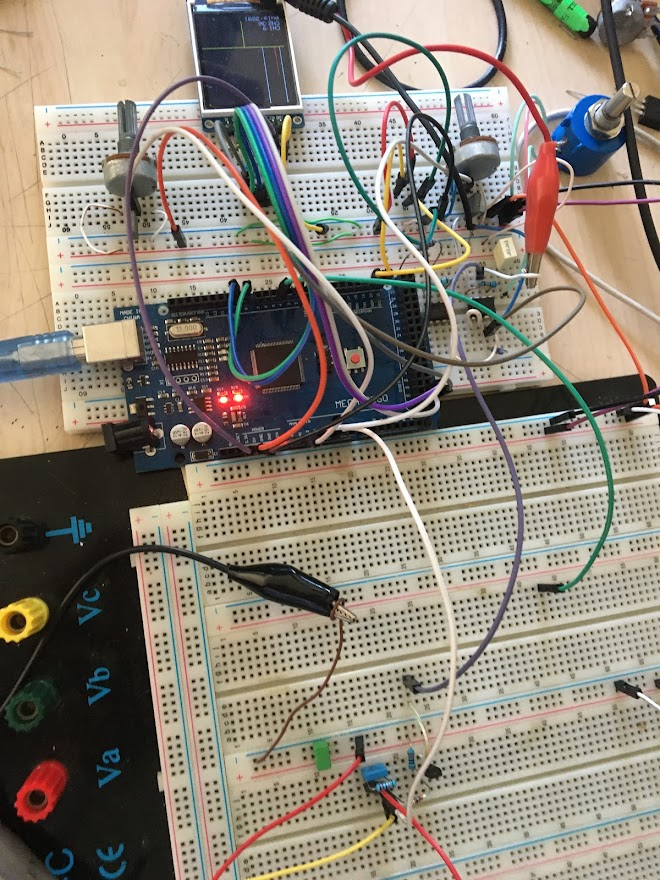

!# rapor.md
# Çok Kanallı Analizör

 

 # [24 Haziran 2021]
* Öncelikle dedektörden gelen sinyal için TLC272 ile bir sinyal yükseltici devresi yaptık. Bu yükseltilmiş sinyali LM311 model komparatörden geçicek şekilde tasarladık. Mikrokontrolcüyü komparatörün çıkışına bağlayarak okuması gereken zamanı komparatör sinyaline senkronladık.

* Gelen sinyal bir op-amp'tan geçerek komparatöre giriyor. Ayarlanabilen eşik değerinin üzerinde bir sinyal gelirse mikrokontrolcüye -HIGH- sinyalini vererek analogRead ile okumasını gerçekleştiriyor. Son ölçümlerde HIGH sinyali geldikten 100 mikrosaniye sonra okuma yapabildiğini ölçtük.
 
* Devreye yaptığımız son güncellemede dedektörden gelen sinyalin genliğinden bağımsız olarak çalışması için dışarıdan ayarlanabilir bir gain mekanizması yerleştirmeyi planladık.

 

 * Gelen sinyalin genişliği (pulse width) okuma yapmak için kısa olduğu gerekçesiyle tepe değerini tutması için bir devre tasarladık. Yük direnci ve kapasitör ayarlanarak istenilen uzunluk elde edilebiliyor. Ard arda gelen sinyalleri okuyabilmek için bir mosfet yardımıyla kapasitörü nötrleyerek yükünün boşaltılması sağlanıyor.

 ### Aşağıdaki örnek 35 microsaniyelik bir sinyalin yaklaşık 25 milisaniye uzunluğa erişebildiğini gösteriyor.
 

 

 # [29 Temmuz 2021]

 * Mosfete gönderilen sinyal kapasitördeki yükü boşaltamıyor. Şimdilik bir sorun yaratmıyor, yeni gelen sinyal yine komparatörden HIGH sinyali yaratacağı için doğru okuma yapmak mümkün. Ancak kapasitörün o anki yükünden daha düşük bir sinyal gelirse yanlış voltaj okumasına neden olabilir.

 * Peak Holder kısmının son hali bu şekilde.

 
 *Devrenin son hali*
 - Devrenin son halini PCB'ye aktarmak için çizimlerini hazırlıyorum.